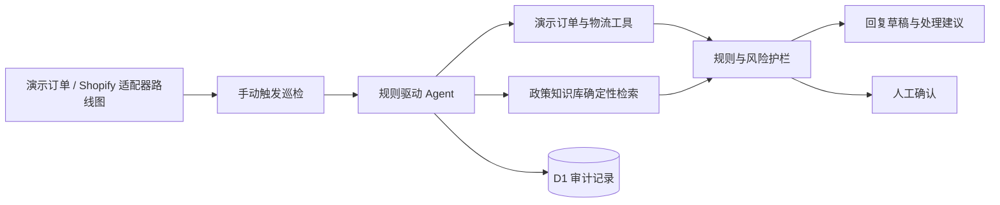

# CrossCare AI

面向中小跨境电商的售后与物流异常 Agent 作品集原型。当前公开版本支持手动触发订单巡检，使用确定性场景规则识别物流异常、匹配售后政策并生成可追溯的客服回复草稿；退款、补发和高价值订单始终交给人工确认。

[在线体验](https://crosscare-ai-agent.xiaobo000312.chatgpt.site) · [项目架构](#系统架构) · [本地运行](#本地运行)


> 公开作品集演示：在线版本只使用虚构订单和测试数据，不会调用 Shopify API，也不包含真实客户信息或 Shopify 密钥。

## 项目亮点

- **按需巡检**：运营人员可点击按钮运行一次巡检并记录结果；定时触发与事件触发监控属于后续路线图。
- **异常识别**：识别未揽收、运输停滞、海关延误、退回和妥投未收到等场景。
- **RAG-ready 政策检索**：当前版本按问题类型确定性匹配政策条款并展示政策编号，尚未使用向量数据库、Embedding 或语义检索；知识库接口可在后续升级为 RAG。
- **规则驱动 Agent 原型**：业务规则负责异常分类、政策匹配与风险底线，模板负责组织回复草稿。
- **人工安全护栏**：退款、补发及高价值订单不会被自动执行。
- **决策摘要可追溯**：D1 记录巡检结果和 Agent 分析完成事件，并保留命中的政策编号与置信度；逐步骤事件日志属于后续路线图。
- **在线持久化**：使用 D1 保存工单、政策、巡检结果和审计记录。

## Agent 工作流

1. 运营人员手动触发一次巡检，读取演示订单与物流状态。
2. 判断是否存在异常以及异常等级。
3. 按问题类型从政策知识库确定性匹配相关条款。
4. 根据订单金额与操作类型执行安全护栏。
5. 根据场景模板生成客服回复草稿和下一步处理建议。
6. 低风险问题自动归档，高风险动作等待人工确认。

## 系统架构



## 技术栈

- TypeScript、React 19
- vinext / Vite
- Cloudflare Workers、D1
- Drizzle ORM
- Node.js Test Runner、ESLint

## 本地运行

要求 Node.js 22.13 或更高版本，并启用 pnpm。

```bash
pnpm install
pnpm dev
```

生产构建与测试：

```bash
pnpm db:generate
pnpm lint
pnpm build
pnpm test
```

默认数据库绑定名为 `DB`。如部署平台使用其他绑定名，可通过
`CROSSCARE_D1_BINDING` 覆盖；公开仓库不依赖内部托管元数据即可构建。

健康检查接口：`/api/health`

## Shopify 对接路线图（尚未启用）

当前公开版本使用内置演示订单，不包含已启用的 Shopify API 适配器。仓库中的环境变量示例仅为后续只读集成预留，不能仅靠填写变量完成连接。

计划中的接入步骤：

1. 实现只读订单与履约查询适配器，并使用最小权限。
2. 为测试店铺配置 OAuth 或受控的开发凭据。
3. 增加 Webhook 验签、失败重试与数据保留策略。
4. 将线上凭据仅保存到部署平台的加密环境变量中。

## 安全边界

- 不自动执行退款、补发或高价值订单操作。
- 不在代码、日志或数据库迁移中保存访问令牌。
- 公开演示环境只使用虚构数据。
- 接入真实店铺前需要补充身份认证、Webhook 验签、权限最小化和数据保留策略。
